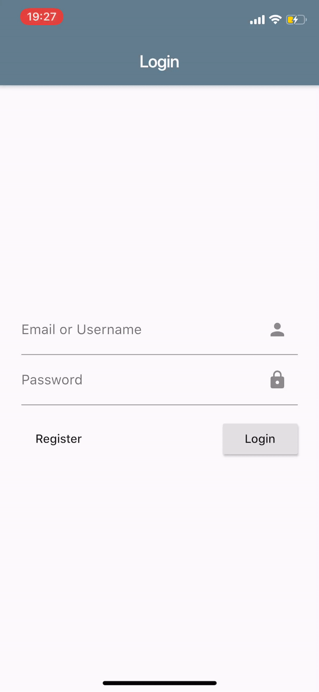

# SharePool Mobile
&copy; Tobias Kaderle & Jan Wiesbauer

## Description
This project is the frontend for the `SharePool` application. SharePool is an application designed to simplify the creation and maintenance of carpool communities. In our opinion, generic money management apps are partly too complexly structured. The simple booking of a ride includes too many steps to be intuitive. That's why we wanted to map this simple process in an application as well.

The complete vision for the application can be found in this [Proposal](PROPOSAL.md).

## Flutter
Googles [Flutter](https://flutter.dev) was used to implement the mobile application. This makes it possible to develop Android, iOS and recently web and desktop apps with a common code base. The application is developed using the programming language [Dart](https://dart.dev), and then compiled in native Swift or Java code.

We were very pleased with the framework, as it offers many standard components, and the development is very pleasant due to features like "Hot-Reload" (code changes are updated on the test device within a second).

## Use-Cases
### Login / Register
At the start of the app the user is prompted to either log in to their account or create a new account. The entered data is validated (valid email, password rule, ...), and if it does not contain any errors, a request can be sent to the server. The data is also validated again on the server and if everything fits, the user token is returned. This token is then required for all other requests to the server to authenticate the user.

### Driver's View
A user who acts as a carpool driver can create and manage tours for his account. If he clicks on the cogwheel icon in the upper right corner, he can see all his trips. Click on an entry to open the editing page. If he clicks on the plus icon at the bottom right, he can create a new trip.

One of the created tours can be selected, whose information is then displayed using the QR code. A click on the magnifying glass icon displays the list of tours from which the desired one can be selected.

### Passenger's View
A passenger can open the camera by clicking on the "Scan QR Code" menu item and scan a tour QR code of a driver. Once the code has been recognized, a request is first sent to the server to obtain the required information (which tour, distance, price, driver, ..), which is then displayed in a dialog. The passenger can check the information and then either confirm or refuse. If he clicks on "Yes" the ride will be confirmed on the server.

### Balance View
After a user has completed several trips, he can view his balance on the "Statistic" page. At the top, the user's overall balance sheet is displayed, and below it, a list of the balance sheets for the individual users. When he selects a user, the individual trips and refunds are listed on a new page. New recounts can be created by clicking on the plus icon at the bottom right.

### Analysis View
So that the user can also display his analysis data, he simply has to swipe the balance sheets to the left to change the tab. There he can see graphs summarizing the day, the kilometres driven and the litres of fuel saved (this data is queried by the Analytics Microservice). The data can be restricted by date, and can also be shown or hidden by clicking on the name in the legend.

